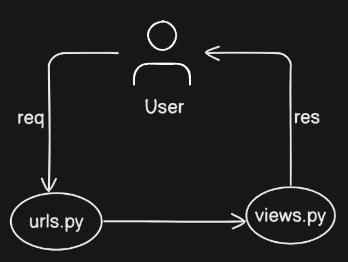

# 🐦 miniTwitter

A sleek social platform for creating and sharing short posts.  
Built with Django and Bootstrap for full-stack CRUD operations.

---

## Live Demo & Video

- watch live link: [here](coming soon)
- Watch demo video: [here](https://drive.google.com/file/d/1uuaNXbSxlDEsFl0c3GAPieloCLm7-YxW/view?usp=sharing)

---

## How to run locally

```
# 1. Clone the repository
git clone https://github.com/satyajit-patel/miniTwitter.git
cd miniTwitter

# 2. Create a virtual environment
python -m venv venv
source venv/bin/activate  # On Windows: venv\Scripts\activate

# 3. Install dependencies
pip install -r requirements.txt

# 4. Run the development server
python manage.py runserver
```


## Some useful commands
- create virtual environment```python -m venv .venv```
- enter to venv ```.venv\Scripts\activate```
- list installed libraries (package.json) ```pip freeze > requirements.txt```
- come out of venv ```deactivate```
- install dependencies ```pip install -r requirements.txt```

#### Install django
```
pip install django
```

#### Start project
```
django-admin startproject miniTwitter
```

- move inside project
```
cd  miniTwitter
```

#### Create app
```
python manage.py startapp tweet
```
###### Notes
- make sure to let the project settings know that we have created an app and include it in urls
- make sure to register in admin.py after making model

##### req-res-flow


#### Run server
```
python manage.py runserver
```


#### Create super user (admin)
```
python manage.py createsuperuser
```

#### Migrate (moves the user model to admin model)
```
python manage.py makemigrations tweet
```
```
python manage.py migrate
```

### settings.py

- imports
```
import os
```

#### Media configuration

- install pillow
```
pip install pillow
```

- set media
```
MEDIA_URL = '/media/'
MEDIA_ROOT = os.path.join(BASE_DIR, 'media')
```

#### Static configuration
- set static
```
STATIC_URL = 'static/'
STATICFILES_DIRS = [os.path.join(BASE_DIR, 'static')]
```

#### Template configuration
- inside DIRS list
```
os.path.join(BASE_DIR, 'templates')
```

### urls.py
- imports
```
from django.conf import settings
from django.conf.urls.static import static
```

- link settings (attach at the end of urlpatterns list)
```
+ static(settings.MEDIA_URL, document_root=settings.MEDIA_ROOT) 
```